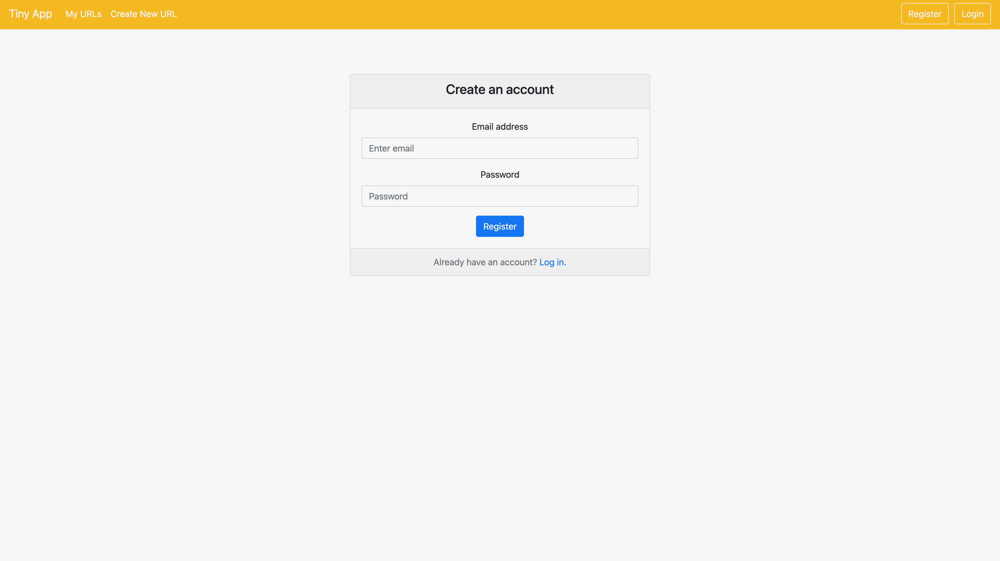
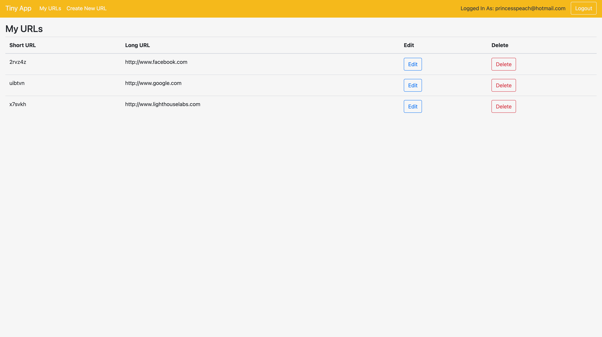
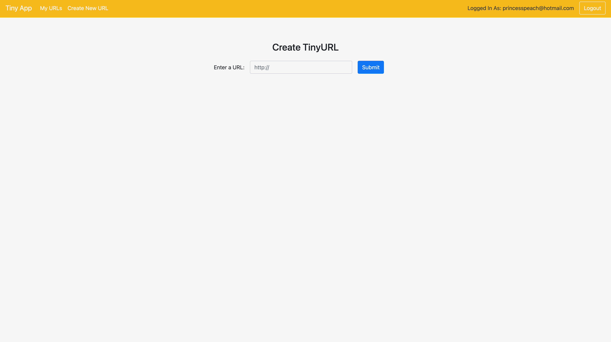
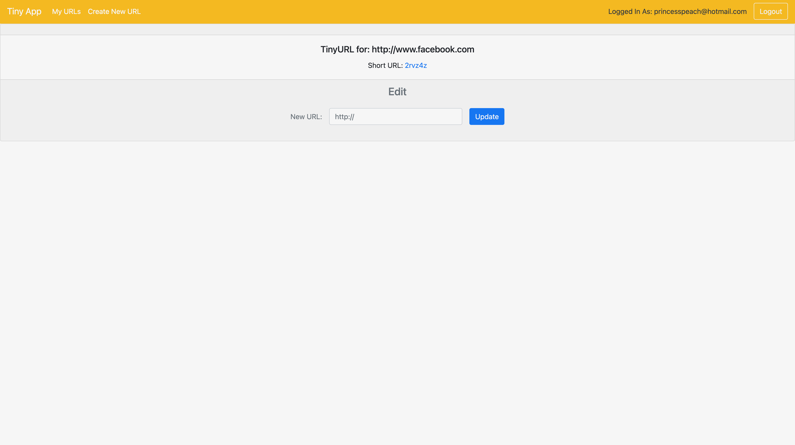
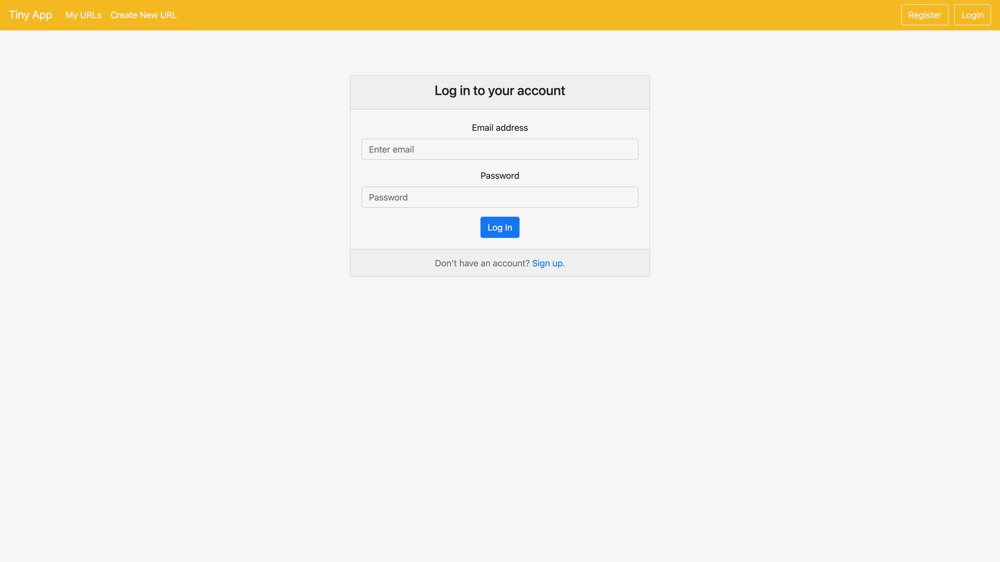

<!-- screenshots- The main ( /urls ) page should be one of them -->
<!-- img file names -urls-page.png  -->

# TinyApp

TinyApp is a simple URL shortener app that takes a regular URL and transforms it into an encoded version (similar to [bit.ly](https://bitly.com/)).
Built with Node and Express for the back end, and EJS and Bootstrap for the front-end.

## Final Product

Create an account to begin creating tinyURLS! 🍾

Once registered or logged in, you can view your home page where all of your tinyURLS are displayed. Here, you also have the option to edit or delete them. ⚙️

Click "Create New URL" in the nav bar to be directed to the this page where you can create a new tinyURL! ✨

You can view the data for a specific tinyURL on this page which will appear after creating a new tinyURL or after clicking "edit" on a tinyURL from the home page. Here, you can also visit the webite for which you created the tinyURL URL by clicking the tinyURL link. 🔍

All your URLS are safe and secure in your own account. Our system ensures to keep your tinyURLS safe from any hackers. When you choose to log out of your account, you will be prompted to log back in. 🔑

## Dependencies

- Node.js
- Express
- EJS
- bcrypt
- body-parser
- cookie-session

## Getting Started

- Install all dependencies (using the `npm install` command).
- Run the development web server using the `node express_server.js` command.
